## Learning Objectives

By the end of this lecture you should be able to:

-   distinguish between **response** and **explanatory** variables
-   explain why regression is used to study relationships between variables
-   interpret a **scatterplot** as an initial tool for investigating a relationship
-   describe the idea of a **regression line** and the **line of best fit**
-   explain the role of **residuals** in assessing model fit
-   distinguish between **explained** and **unexplained** variation
-   interpret the coefficient of determination, $R^2$, as a measure of model fit

## Lecture Overview

In this lecture we will cover:

-   a brief recap of key statistical ideas
-   response and explanatory variables
-   scatterplots and first impressions of a relationship
-   regression lines and the line of best fit
-   residuals and model fit
-   explained and unexplained variation
-   the coefficient of determination, $R^2$
-   the general logic of regression as a statistical modelling tool

## Introduction

Regression is one of the most important tools in statistical analysis.

Its purpose is to help us describe, quantify, and interpret relationships between variables. Before applying regression to a real dataset, it is important to understand the key ideas that underpin it.

In this lecture we focus on the concepts and intuition of regression: scatterplots, regression lines, residuals, explained and unexplained variation, and the meaning of $R^2$.

## Recap: Basic Statistical Concepts

This section revisits a few core ideas that help us explore data with two main aims:

-   to summarise and understand the main features of the variables in a dataset
-   to investigate whether meaningful relationships exist between variables

A good starting point is to ask a simple question: what do we mean by data in statistics?

## Population and Sample

Two key terms are **population** and **sample**.

A **population** is the complete set of individuals, objects, or cases that are relevant to the question being studied.

A **sample** is a subset taken from that population and used to learn about the wider group.

In an ideal world, we would observe the entire population and work with complete information. In practice, this is often impossible because populations can be too large, too costly, or too difficult to measure in full. For this reason, analysts typically work with a sample and use it to make **inferences** about the population.

Because conclusions are often based on a sample rather than the full population, the way the sample is chosen matters a great deal. A useful sample should reflect the population fairly.

A simple and important idea is that of a **random sample**:

> A random sample is one in which every member of the population has an equal chance of being selected.

Once we rely on sample data, there is always some uncertainty because the sample may not perfectly reflect the full population. This is sometimes called **sampling error**. A major goal of statistical analysis is therefore to make sensible conclusions while recognising that uncertainty.

::: callout-important
A sample must be chosen carefully if we want our conclusions to be credible.
:::

Unrepresentative samples can be seriously misleading. A classic popular example is Darrell Huff’s book *How to Lie with Statistics*, which gives memorable examples of how poor sampling can distort conclusions.

## Analysing Sample Data

Most datasets are collected to help answer a particular question or investigate a practical problem. Before carrying out any formal analysis, the analyst should stop and make sure the context is clear.

In particular, it is important to ask:

-   Is the problem under investigation clearly understood?
-   Are the objectives of the analysis well defined?
-   Do I understand what each variable is actually measuring or recording?

::: callout-note
A good analyst does not rush into calculations. The first task is to understand the data and the problem it relates to.
:::

Often the only way to clarify the problem is to ask questions until the purpose of the data and the meaning of the variables are fully understood.

## Describing Variables

A first step in any analysis is to look at the individual variables in the dataset.

Broadly speaking, variables fall into two categories:

-   **Attribute variables**: variables whose outcomes are categories or labels\
    Examples: gender, day of the week

-   **Measured variables**: variables recorded on a numerical scale\
    Examples: age, weight, income

Attribute variables are often turned into numerical codes for analysis, but they remain categorical in nature.

Measured variables can be divided further into:

-   **continuous variables**, which can in principle take any value on a scale\
    Example: height

-   **discrete variables**, which arise from counting\
    Example: number of passengers on a flight

## Statistical Distributions

The idea of a distribution is central in statistics.

A distribution describes how values are spread out across a variable. For a population, this describes the full pattern of outcomes. For a sample, we use the observed data to estimate that pattern.

For an attribute variable, the distribution is described by the frequency of each category.

For a measured variable, the distribution can be described using summary measures that capture its main features.

### Example: Attribute Variable

Attribute variables describe categories or qualities rather than numerical measurements.

Examples include:

-   gender
-   day of the week
-   type of product
-   political party affiliation

Because these variables represent categories, we cannot meaningfully calculate numerical summaries such as means or standard deviations.

Instead, we describe their distribution by counting how often each category occurs.

The most common way to visualise this is with a bar chart, where the height of each bar represents the number of observations in that category.

```{r}
#| echo: false

barplot(
  c(5, 9),
  names.arg = c("Category 1", "Category 2"),
  ylim = c(0, 10),
  col = c("#CDB79E", "darkolivegreen3"),
  ylab = "Count of items"
)
```

In this example, the chart simply shows how many observations fall into each category.

The key idea is that the distribution of an attribute variable is described by the frequency of each category.

### Example: Measured Variable

Measured variables take numerical values on a scale.

Examples include:

-   age
-   income
-   height
-   exam score

Because these variables are numerical, their distribution can be described using a continuous curve that shows how values are spread across the scale.

The figure below illustrates a typical distribution for a measured variable.

```{r}
#| echo: false

x <- seq(-3, 3, length = 200)
s <- 1
mu <- 0
y <- (1 / (s * sqrt(2 * pi))) * exp(-((x - mu)^2) / (2 * s^2))

plot(x, y,
     type = "l",
     lwd = 2,
     axes = FALSE,
     xlab = "",
     ylab = "")

axis(1, at = -3:3, labels = c("-3", "-2", "-1std", "mean", "1std", "2", "3"))
abline(v = 0, col = "red", lwd = 2, lty = 2)
abline(v = c(-1, 1), col = "blue", lwd = 2, lty = 3)
```

This curve represents a distribution, showing how frequently different values occur.

Several important features can be seen in such distributions:

-   the centre (often represented by the mean or median)
-   the spread (how widely values are distributed)
-   the shape or symmetry of the distribution

These characteristics help analysts summarise and interpret the behaviour of numerical variables in a dataset.

## What Does a Distribution Tell Us?

For an attribute variable, the interpretation is straightforward. We simply observe how frequently each category occurs. In the previous example, this was shown using a bar chart, where the height of each bar represents the number of observations belonging to that category.

For a measured variable, the situation is slightly different. Instead of categories, we are interested in how numerical values are distributed across a scale. In a continuous distribution, the area under the curve between two values represents the proportion of observations that fall within that range.

To understand the behaviour of a measured variable, statisticians typically describe its distribution using three main characteristics:

-   the centre of the distribution
-   the spread (or width) of the distribution
-   the shape or symmetry of the distribution

### Measures of Centre

The most common measures used to describe the centre of a distribution are:

-   the **mean** (the arithmetic average)
-   the **median** (the middle value of the ordered data)

The median is defined as the value that divides the ordered dataset into two equal halves: half the observations lie below the median and half lie above it.

### Measures of Spread

To describe the spread or variability of the distribution, two commonly used measures are:

-   the **standard deviation**
-   the **interquartile range (IQR)**

The standard deviation measures how far observations typically deviate from the mean. A larger standard deviation indicates that the data are more widely spread.

The interquartile range measures the spread of the middle 50% of the data and is calculated as the difference between the third and first quartiles.

### Quartiles

Quartiles divide an ordered dataset into four parts:

-   **Q1 (first quartile):** 25% of the observations lie below this value
-   **Q2 (second quartile):** 50% of the observations lie below this value (this is the median)
-   **Q3 (third quartile):** 75% of the observations lie below this value

The interquartile range is therefore:

$$
IQR = Q_3 - Q_1
$$

The diagram below illustrates these ideas.

```{r}
#| echo: false

par(mfrow = c(2,1), mar = c(3.1,3.1,1.1,2.1))

xseq <- seq(-4, 4, 0.01)
densities <- dnorm(xseq, 0, 1)

plot(xseq, densities,
     col = "darkgreen",
     xlab = "",
     ylab = "Density",
     type = "l",
     lwd = 2,
     main = "Example Distribution",
     axes = FALSE)

axis(1, at = -4:4,
     labels = c("min", "-3", "Q1", "-1", "median", "1", "Q3", "3", "max"))

abline(v = 0, col = "red", lwd = 2, lty = 2)
abline(v = c(-2, 2), col = "blue", lwd = 2, lty = 3)
abline(v = c(-4, 4), col = "black", lwd = 2, lty = 3)

boxplot(xseq,
        horizontal = TRUE,
        outline = TRUE,
        frame = FALSE,
        col = "darkolivegreen3")
```

Conventionally:

-   the **mean and standard deviation** are reported together as one pair of summary measures
-   the **median and interquartile range** are reported together as another pair

These pairs provide complementary descriptions of the location and spread of the data.

### Symmetry and Skewness

Another important feature of a distribution is its symmetry.

A simple way to assess symmetry is to compare the mean and the median:

-   if they are approximately equal, the distribution is likely to be symmetric
-   if they differ substantially, the distribution may be skewed

One numerical measure of skewness is Pearson’s coefficient of skewness:

$$
\text{Pearson's Skewness}
=
\frac{3(\text{mean} - \text{median})}{\text{standard deviation}}
$$

The quartile measure of skewness is defined as:

$$
\text{Quartile Skewness}
=
\frac{(Q_1 - Q_3) - (Q_2 - Q_1)}{Q_3 - Q_1}
$$

::: callout-tip
### Key points

-   data are described through variables
-   variables can be **attribute** or **measured**
-   the distribution of a measured variable can be summarised using:

**Measures of centre** - mean - median

**Measures of spread** - standard deviation - interquartile range

These statistics provide a concise numerical description of the distribution of a variable in a dataset.
:::

## Investigating Relationships Between Variables

A central aim of data analysis is to investigate whether **relationships exist between variables**.

To do this, we usually classify variables into two roles:

-   a **response variable**
-   an **explanatory variable**

A **response variable** is the outcome we want to understand or explain.

An **explanatory variable** is a variable that may help explain changes in the response.

This distinction is important because the choice of statistical method depends on the type of response variable and the type of explanatory variable.

## Bivariate Relationships

When we study the relationship between **two variables**, we are looking at a **bivariate relationship**.

In practice, there are four main combinations of response and explanatory variable types. These combinations are shown below.

```{r}
#| label: RelationshipMatrix
#| echo: false
#| out-width: "500px"
#| fig-align: center

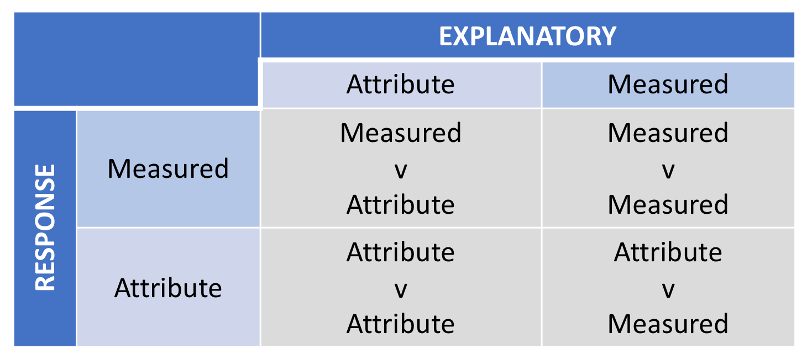
```

The starting point is always to examine the variables carefully and decide:

-   which variable is the response

-   which variable is the explanatory

-   what type of variable each one is

::: callout-note
In larger studies, there may be more than one objective and more than one possible response variable.
:::

The method used to investigate a relationship depends on the type of variables involved. Different combinations require different statistical tools, and using the wrong method can lead to misleading conclusions.

### A Data-Analysis Framework

Before carrying out a formal analysis, it is important to be clear about what we mean by a relationship between two variables.

This gives us a framework for defining a data-analysis process that can be used to explore the connection between them.

A sensible first step is to use simple descriptive statistics and graphs to get an initial impression of the relationship. This early stage is often called Initial Data Analysis (IDA).

The purpose of IDA is to decide whether:

-   there is clear evidence of a relationship

-   there is little evidence of a relationship

-   the situation is unclear and further analysis is needed

If the initial analysis is inconclusive, we move on to Further Data Analysis (FDA).

FDA aims to help us decide between two broad conclusions: 1. there is no evidence of a relationship 2. there is evidence of a relationship

If the evidence suggests a relationship exists, the next step is to describe the nature of that relationship.

::: callout-tip
The key question is:

Based on the sample data, is there evidence of a relationship between the response variable and the explanatory variable?
:::

This process can be represented diagrammatically as follows.

```{r}
#| label: DAM
#| echo: false
#| out.width: 500px
#| fig.align: center

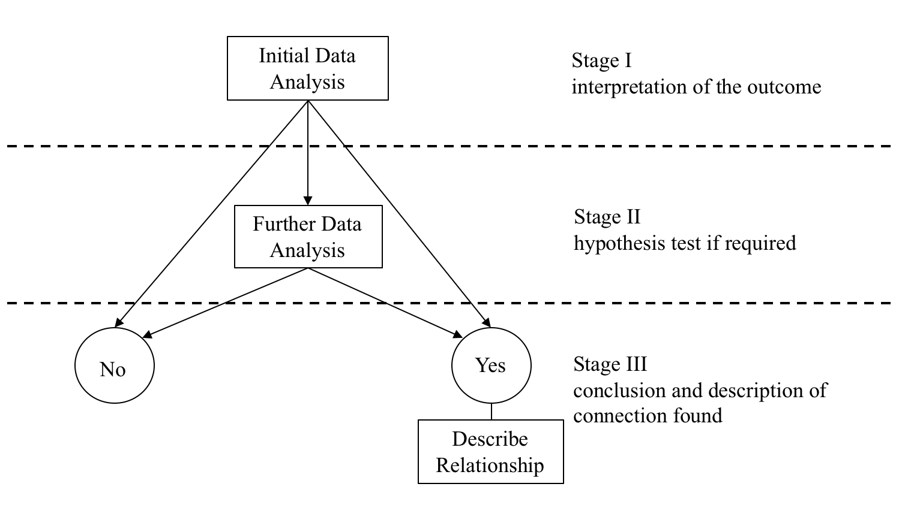
```

For each of the main data-analysis situations, the analyst needs to know:

-   what the Initial Data Analysis should look like

-   how to interpret that initial evidence

-   when Further Data Analysis is needed

-   how to interpret the outcome of the formal analysis

### Measured Response vs Attribute Explanatory Variable

Suppose the response variable is measured and the explanatory variable is an attribute variable with two levels.

A relationship exists if the average value of the response changes depending on the category of the explanatory variable.

For example, if the explanatory variable has two levels, say red and blue, then there is no relationship if the distribution of the response is essentially the same in both groups.

If the two distributions differ, then the level of the explanatory variable may be influencing the response.

This idea is illustrated below.

```{r}
#| label: MvADAM
#| echo: false
#| out.width: 500px
#| fig.align: center

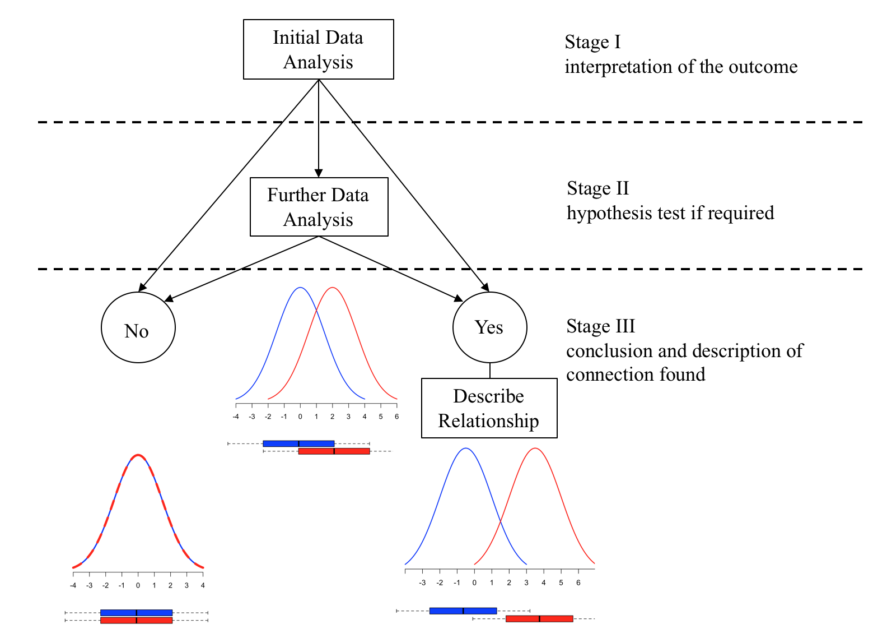
```

### Measured Response vs Measured Explanatory Variable

Now suppose both the response and explanatory variables are measured.

Imagine a large population in which, for each individual, we record:

-   $(Y)$: the response variable

-   $(X)$: the explanatory variable

If we plotted all values of $(Y)$ against $(X)$, and every point lay exactly on a line, then the relationship would be perfectly predictable. Once $(X)$ was known, $(Y)$ would be known exactly.

This is called a deterministic relationship.

In real data, this is unusual. Most of the time, the response variable is influenced not only by (X), but also by other factors.

A useful way to express this idea is:

$$
Y = f(X) + e
$$

where:

-   $(f(X))$ is the part of $(Y)$ explained by $(X)$

-   $(e)$ represents the effect of other factors

This means that the variation in $(Y)$ can be thought of as having two parts:

1.  explained variation: the part associated with changes in $(X)$

2.  unexplained variation: the part due to other influences

So we can write:

$$
\text{Total Variation} = \text{Explained Variation} + \text{Residual Variation}
$$

This idea is fundamental to regression.

It raises two important questions:

1.  Can we build a model that describes the relationship?

2.  Can we measure how much of the variation in $(Y)$ is explained by $(X)$?

One important summary measure is $(R^2)$, defined as the proportion of total variation in $(Y)$ explained by the model.

$$
R^2 =
\frac{\text{Explained variation}}{\text{Total variation}}
$$

This takes values between 0 and 1, and is often expressed as a percentage.

Very roughly:

$$
R^2: \; 0\% \; (\text{no relationship})
\quad \longrightarrow \quad
100\% \; (\text{perfect relationship})
$$

The value of $(R^2)$ is a useful way of assessing how strongly a measured explanatory variable is related to a measured response variable.

The general framework is shown below.

```{r}
#| label: MvMDAM
#| echo: false
#| out.width: 500px
#| fig.align: center

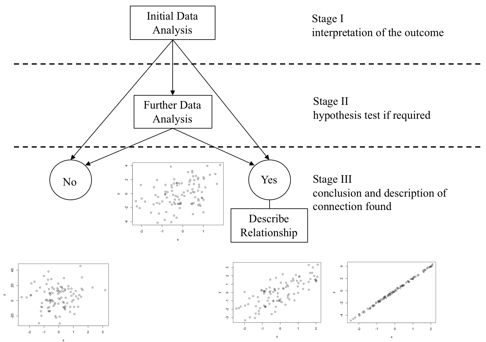
```

::: callout-note
In practice, a very small $(R^2)$ does not automatically prove that there is no relationship. It may still be necessary to carry out a formal statistical test to decide whether the observed relationship is statistically significant.
:::

### Further Data Analysis

If the Initial Data Analysis is not sufficient to reach a conclusion, then Further Data Analysis is required.

Further Data Analysis uses more formal statistical procedures to help decide between two possibilities:  -

-   there is no relationship

-   there is a relationship

These formal procedures are usually called hypothesis tests.

A hypothesis test provides a decision rule for choosing between the two possible conclusions on the basis of the sample evidence.

Most hypothesis tests follow four stages:

1.  Specify the hypotheses

2.  Define the test statistic and decision rule

3.  Examine the sample evidence

4.  State the conclusion

### Common Statistical Models Used in Further Data Analysis

Typical methods include:

-   t-test for a measured response and an attribute explanatory variable with exactly two levels

-   one-way ANOVA for a measured response and an attribute explanatory variable with more than two levels

-   simple regression for a measured response and a measured explanatory variable

-   multiple regression for a measured response and several explanatory variables

-   chi-square test of independence for two attribute variables

Let us now build on these ideas and introduce **regression modelling**, one of the most fundamental tools in statistical analysis.

Regression provides a way to describe and quantify the relationship between variables using a mathematical model.

## Regression: Concepts and Intuition

In this section we focus on the basic ideas behind regression for a **measured response variable** and a **measured explanatory variable**.

The goal is to understand how regression helps us:

-   detect whether a relationship may exist
-   describe the nature of that relationship
-   assess how well the model explains variation in the response

Earlier we looked at some basic statistical concepts. This section examines how to investigate the nature of any relationship that may exist between a measured response variable and a measured explanatory variable.

The first step is to have a clear idea of what is meant by a connection between the response variable and the explanatory variable. The next step is to use some **simple sample descriptive statistics** to have a first look at the nature of the link between the response variable and the explanatory variable. This simple approach will lead to one of three conclusions, namely, on the basis of the sample information:

i.  there is very strong evidence to support a link
ii. there is absolutely no evidence of any link
iii. the sample evidence is inconclusive and further more sophisticated data analysis is required

This step is called the **Initial Data Analysis** or the **IDA**.

If the IDA suggests that **Further Data Analysis** is required, then this step seeks one of two conclusions:

i.  The sample evidence is consistent with there being no link between the response variable and the explanatory variable.
ii. The sample evidence is consistent with there being a link between the response variable and the explanatory variable.

As we have already seen in the previous sections, this process can be represented diagrammatically as:

```{r DAMeth, out.width = "500px",  fig.align = 'center', echo=FALSE}

```

The Data-Analysis Methodology seeks to find the answer to the following key question:

-   On the basis of the sample data, is there evidence of a connection/link/relationship between the response variable and the explanatory variable?

The final outcome is one of two conclusions:

a)  There is no evidence of a relationship, labelled as the ‘No’ outcome in the diagram above, in which case the analysis is finished.

b)  There is evidence of a relationship, labelled as the ‘Yes’ outcome in the diagram above, in which case the nature of the relationship needs to be described.

The first step is to have a clear idea of what is meant by a connection between a measured response variable and a measured explanatory variable. Imagine a population under study consisting of a very large number of population members, and on each population member two measurements are made, the value of $Y$ the response variable and the value of $X$ the explanatory variable. For the whole population a graph of $Y$ against $X$ could be plotted conceptually. If the graph appears as in the diagram below, then there is quite clearly a link between Y and X. If the value of $X$ is known, the exact value of Y can be read off the graph. This is an unlikely scenario in the data-analysis context, because the relationship shown is a **deterministic relationship**. *Deterministic means that if the value of* $X$ is known then the value of $Y$ can be precisely determined from the relationship between $Y$ and $X$.

```{r deterministic_relationship, out.width = "500px",  fig.align = 'center', echo=FALSE}
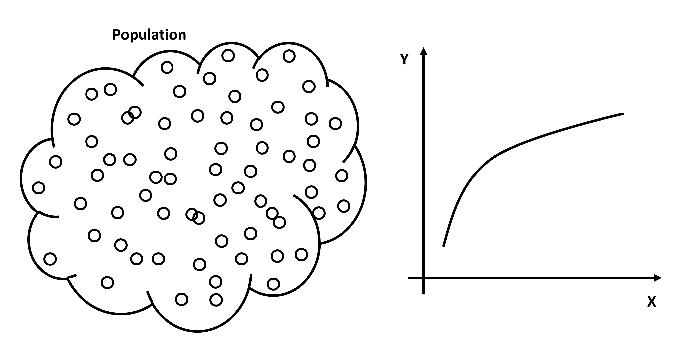
```

## Scatter Plot

When analysing the relationship between the two measured variables we start off by creating a scatter plot. A scatter plot is a graph that shows one axis for the explanatory variable commonly known in regression modelling as a predictor and labelled $X$, and one axis for the response variable, which is labelled $Y$ and commonly known as the outcome variable. Thus, each point on the graph represents a single $(X, Y)$ pair. The primary benefit is that the possible relationship between the two variables can be viewed and analysed with one glance and often the nature of a relationship can be determined quickly and easily.

Let us consider a few scatter plots. The following graph represents a **perfect linear relationship**. All points lie exactly on a straight line. It is easy in this situation to determine the intercept and the slope, i.e. gradient and hence specify the exact mathematical link between the response variable $Y$ and the explanatory variable $X$.

\-**Graph 1**

```{r Yes_perfect, out.width = "500px",  fig.align = 'center', echo=FALSE}
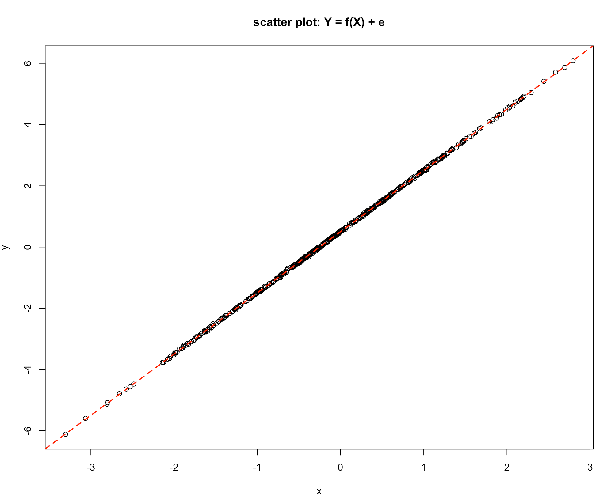
```

The relationship shown in *Graph 2* shows clearly that as the value of $X$ increases the value of $Y$ decreases, but not exactly on a straight line as in the previous scatter plot. This is showing a statistical link, as the value of the explanatory variable $X$ increases the value of the response variable $Y$ also tends to increase. An explanation for this is that the response $Y$ may depend on a number of different variables, say $X_1$, $X_2$, $X_3$, $X_4$, $X_5$, $X_6$ etc. which could be written as:

$Y = f(X_1, X_2, X_3, X_4, X_5, X_6, ...)$

\-**Graph 2**

```{r Yes_50, out.width = "500px",  fig.align = 'center', echo=FALSE}
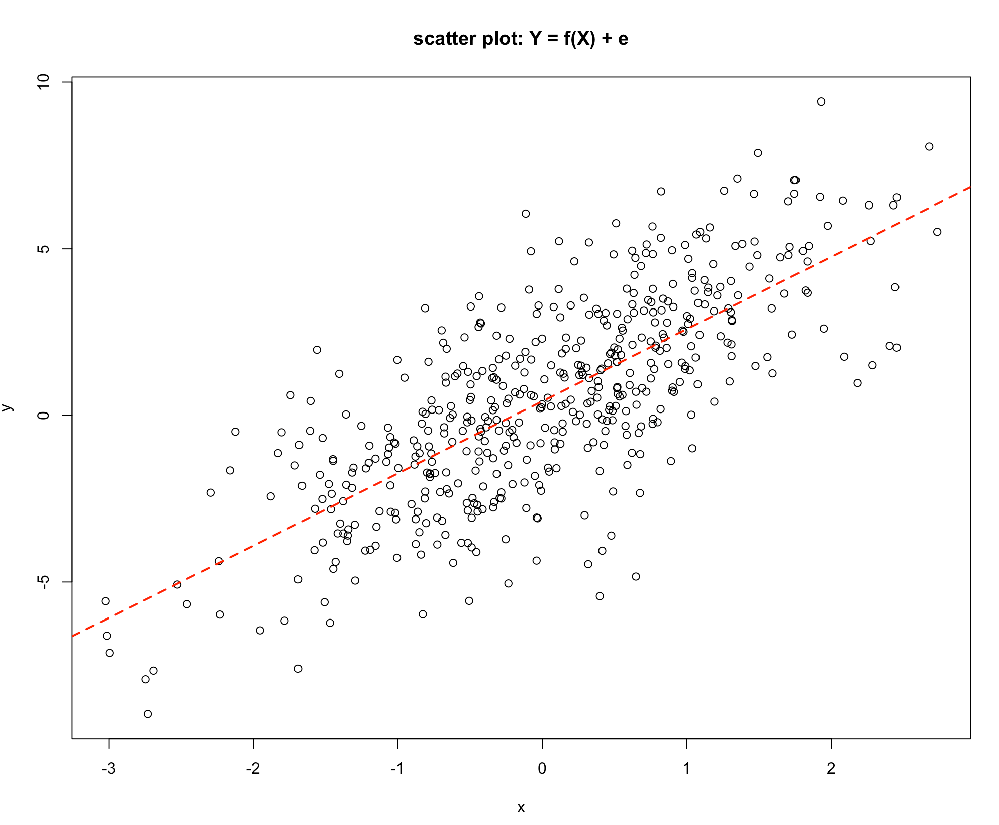
```

If the nature of the link between $Y$ and $X$ is under investigation then this could be represented as:

$$Y = f(X) + \text{effect of all other variables}$$

[The effect of all other variables is commonly abbreviated to **e**.]{style="color:darkred"}

*Graph 1* shows a link where the effect of all the other variables is nil. The response $Y$ depends solely on the variable $X$, *Graph 2* shows a situation where $Y$ depends on $X$ but the other variables also have an influence.

Consider the model:

$$Y = f(X) + e$$ Remember 😃, $\text{e is the effect of all other variables}$!

The influence on the response variable $Y$ can be thought of as being made up of two components:

i.  the component of $Y$ that is explained by changes in the value of $X$, \[the part due to changes in $X$ through $f(X)$\]
ii. the component of $Y$ that is explained by changes in the other factors \[the part not explained by changes in $X$\]

Or in more abbreviated forms:

i.  the *Variation in* $Y$ Explained by changes $X$ or **Explained Variation** and
ii. the *Variation in* $Y$ not explained by changes in $X$ or the **Unexplained Variation**

The Total Variation in $Y$ is made up of two components:

1)  *Changes in* $Y$ Explained by changes in $X$ and the
2)  *Changes in* $Y$ not explained by changes in $X$

Which may be written as:

$$\text{The Total Variation in Y} = \text{Explained Variation} + \text{Unexplained Variation}$$

In *Graph 1* the **Unexplained Variation is nil**, since the value of $Y$ is completely determined by the value of $X$. In *Graph 2* the **Explained Variation is large relative to the Unexplained Variation**, since the value of $Y$ is very largely influenced by the value of $X$.

Consider Graph 3. Here there is no discernible pattern, and the value of Y seems to be unrelated to the value of X.

**- Graph 3**

```{r No_relationship, out.width = "500px",  fig.align = 'center', echo=FALSE}
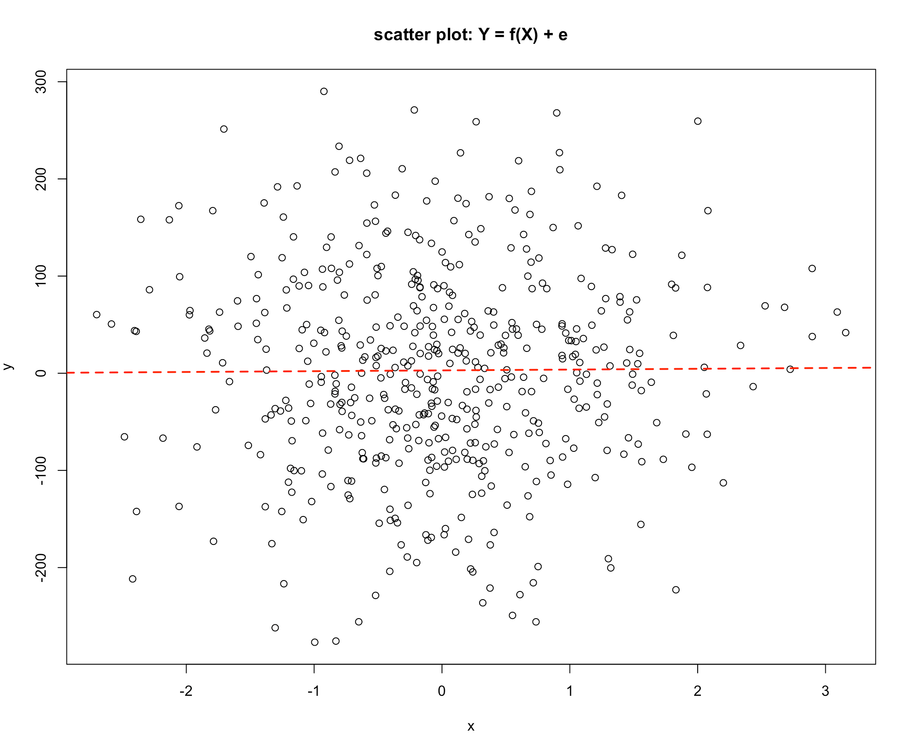
```

If $Y$ is not related to $X$ the **Explained Variation component is zero** and all the changes in $Y$ are due to the other variables, that is the **Unexplained Variation**.

Finally, consider Graphs 4 & 5 below:

\-**Graph 4**

```{r Yes_75, out.width = "500px",  fig.align = 'center', echo=FALSE}
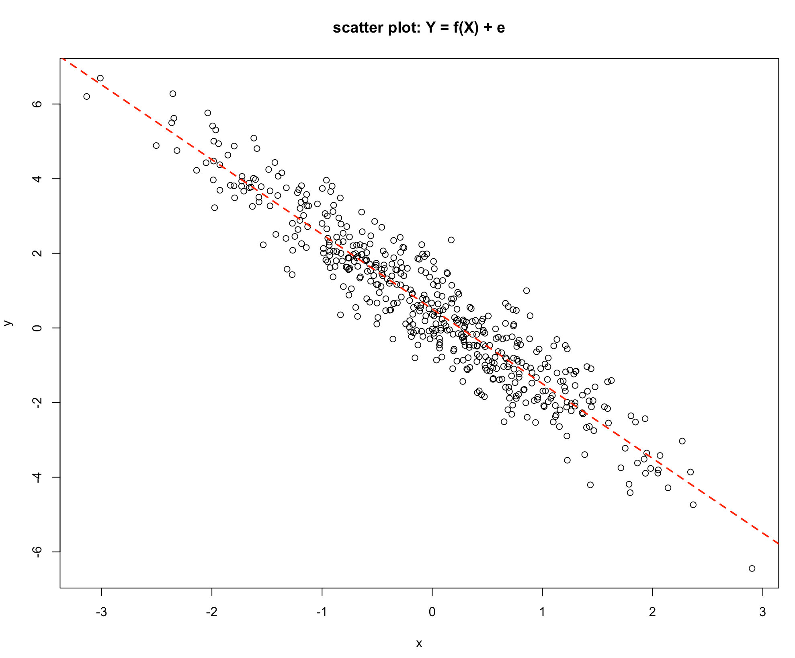
```

\-**Graph 5**

```{r deterministic_neg, out.width = "500px",  fig.align = 'center', echo=FALSE}
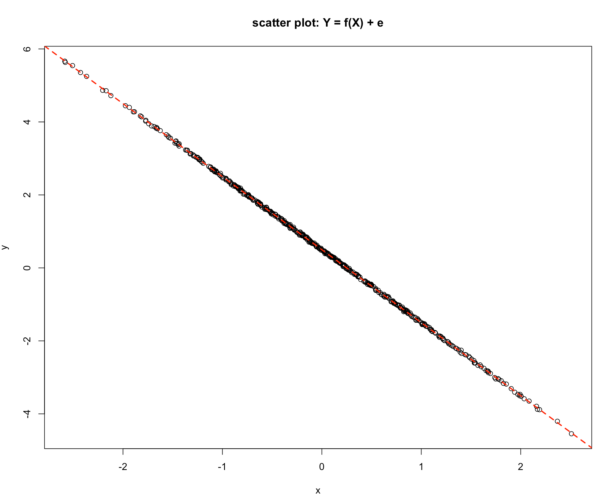
```

*Graph 4* shows a similar picture to *Graph 2*, the difference being that as the value of $X$ increases the value of $Y$ decreases. The value of $Y$ is influenced by the value of $X$, so the **Explained Variation is high relative to the Unexplained Variation**. Consider the last graph, *Graph 5*, which is a deterministic relationship. **The value of** $Y$ is completely specified by the value of $X$. Hence the **Unexplained Variation is zero**.

Graphs Summary:

|                            | Graph 1 | Graph 2 | Graph 3 | Graph 4 | Graph 5 |
|----------------------------|---------|---------|---------|---------|---------|
| Explained Variation in Y   | All     | High    | Zero    | High    | All     |
| Unexplained Variation in Y | Zero    | Low     | All     | Low     | Zero    |

In regression the discussion started with the following idea: $$Y = f(X) + e$$ And to quantify the strength of the link the influence on Y was broken down into two components: i. $$\text{The Total Variation in Y} = \text{Explained Variation} + \text{Unexplained Variation}$$

This presents two issues:

-   A: Can a model of the link be made?
-   B: Can **The Total Variation in Y**, **Explained Variation** and the **Unexplained Variation** be measured?

[ The simplest form of connection is a straight-line relationship and the question arises could a straight-line relationship be matched with the information contained in the graphs 1-5? ]{style="color:darkred"}

-   Clearly it is easy for Graph 1 and Graph 5, the intercept and the gradient can be obtained directly from the graph. The relationship can then be written as:

$$Y = a + bX$$ where:

i)  a is the intercept and

ii) b is the gradient

-   Since the **Explained Variation** is the same as the **Changes in Y** and the **Unexplained Variation** **is zero**, the precise evaluation of these is not necessary.

## Developing a statistical model

For the statistical relationships as shown in *Graphs* *2* & *4*:

a)  Can the intercept and gradient be measured?

b)  Can the values of the three quantities *The Total Variation in Y*, *Explained Variation* and *The Unexplained Variation* be measured?

It is sufficient to work out any two since:

$$\text{The Total Variation in Y} = \text{Explained Variation} + \text{Unexplained Variation}$$

Fitting a line by eye is subjective. It is unlikely that any two analysts will draw exactly the same line, hence the intercept and gradient will be slightly different from one person to the next. What is needed is an agreed method that will provide an estimate of the intercept and the gradient.

Consider the simple numerical example below:

Suppose we would like to fit a straight-line relationship to the following data:

| data |     |     |     |     |     |     |     |
|------|-----|-----|-----|-----|-----|-----|-----|
| $X$  |     | 1   | 2   | 3   | 4   | 5   | 6   |
| $Y$  |     | 7   | 8   | 12  | 13  | 14  | 18  |

The problem is to use this information to measure **the intercept** and **the gradient** for this data set.

A simple way to do this is to draw what is considered to be **the line of best fit** by judgement or guesswork! 😁😉

**The intercept** can be read off the graph as approximately $5$, and **the gradient** can be simply measured since if $X = 0$ then $Y = 5$, and if $X = 5$ then $Y = 15$, so for a change in $X$ of $5$ units (from 0 to 5) $Y$ changes by $10$, from $5$ to $15$. The definition of **the gradient** is **The change in Y for a unit increase in X** hence the gradient for this data set is $10/5 = 2$.

```{r, echo=TRUE}
x <- c(1:6)
y <- c(7, 8, 12, 13, 14, 18)
plot(x, y, pch = 16, main = "y = 5 + 2x + e", xlim = c(0.25, 6), ylim = c(0, 20))
abline(a = 5, b = 2, lwd = 2, lty = 2, col = 2)
```

The straight-line relationship obtained by this process is $$\hat{Y} = 5 + 2*X$$.\
Note, $\hat{Y}$ is a notation for the value of $Y$ as predicted by the straight-line relationship.

We can add more information about the predicted values of $Y$ by the *"estimated"* model to our table, so that we have

| X   | Y   | $\hat{Y}$ | ${Y - \hat{Y}}$ |
|-----|-----|----------:|----------------:|
| 1   | 7   |      7.00 |            0.00 |
| 2   | 8   |      9.00 |           -1.00 |
| 3   | 12  |     11.00 |            1.00 |
| 4   | 13  |     13.00 |            0.00 |
| 5   | 14  |     15.00 |           -1.00 |
| 6   | 18  |     17.00 |            1.00 |

Looking at the information contained in the previous plot, the column headed $\hat{Y}$ contains the predicted values of $Y$ for the values of $X$. For example, the first value of $\hat{Y}$ is when $X = 1$ and $Yp = 5 + 2*X$ so $\hat{Y} = 5 +2*1 = 7$. The column headed $(Y - \hat{Y})$ is the difference between the actual value and the value predicted by the line. For example when $X = 1$, $Y = 7$ and $\hat{Y} = 7$ so the predicted value lies on the line, as can be seen in the graph. For the value $X = 2$ the actual value lies $1$ unit below the line, as can also be seen from the graph.

The column $(Y - \hat{Y})$ **measures the disagreement between the actual data and the line** and a sensible strategy is to **make this level of disagreement as small as possible**. Referring to the graph in the table above, notice that sometimes the actual data value is below the line and sometimes it is above the line, so on average the value will be close to zero. In this particular example the sum of the $(Y - \hat{Y})$ values add up to zero (in a more conventional notation $\Sigma(Y - \hat{Y})  = 0$). The quantity $\Sigma(Y - \hat{Y})$ does not seem to be a satisfactory measure of disagreement, because there are a number of different lines with the property $\Sigma(Y - \hat{Y}) = 0$.

**A way of obtaining a satisfactory measure of disagreement is to square the individual** $(Y - \hat{Y})$ values and add them up. i.e. obtain the quantity $\Sigma(Y - \hat{Y})^2$. The result is always a positive number since the square of a negative number is positive. If this quantity is then chosen to be as small as possible then the level of disagreement between the actual data points and the fitted line is the least. This provides a criterion for the choice of the best line.

The quantity $\Sigma(Y - \hat{Y})^2$ can be easily calculated and added to our table

| X   | Y   | $\hat{Y}$ | ${Y - \hat{Y}}$ | $(Y - \hat{Y})^2$ |
|-----|-----|----------:|----------------:|------------------:|
| 1   | 7   |      7.00 |            0.00 |                 0 |
| 2   | 8   |      9.00 |           -1.00 |                 1 |
| 3   | 12  |     11.00 |            1.00 |                 1 |
| 4   | 13  |     13.00 |            0.00 |                 0 |
| 5   | 14  |     15.00 |           -1.00 |                 1 |
| 6   | 18  |     17.00 |            1.00 |                 1 |

The quantity $\Sigma(Y - \hat{Y})^2$ is a measure of the disagreement between the actual $Y$ values and the values predicted by the line. If this value is chosen to be as small as possible then the disagreement between the actual Y values and the line is the smallest it could possibly be, hence the line is **The line of Best Fit**.

This procedure of finding the intercept and the gradient of a line that makes the quantity $\Sigma(Y - \hat{Y})^2$ a minimum is called **The Method of Least Squares**.

**The Method of Least Squares** was developed by [K. F Gauss (1777 - 1855)](https://link.springer.com/referenceworkentry/10.1007%2F978-1-4020-4423-6_105) a German mathematician, Gauss originated the ideas and a Russian mathematician [A. A. Markov (1856 - 1922)](https://en.wikipedia.org/wiki/Andrey_Markov) developed the method.

In R we use the `lm( )` function to fit linear models as illustrated below.

```{r, echo=TRUE}
x <- c(1:6)
y <- c(7, 8, 12, 13, 14, 18)
plot(x, y, pch = 16, main = "y = f(x) + e", xlim = c(0.25, 6), ylim = c(0, 20))
abline(lm(y~x), lwd = 2, lty = 2, col = 2)
```

The final issue is to find out how to measure the three quantities:

i.  The Total Variation in $Y$
ii. The Explained Variation
iii. The Unexplained Variation

Taking these quantities one at a time they can be measured as follows:

**The Unexplained Variation**

This turns out to be very simple to measure. The quantity: $\Sigma(Y - \hat{Y})^2$ is a measure of the Unexplained Variation. If the line were a perfect fit to the data, the value predicted by the line and the actual value would be exactly the same and the value of the quantity $\Sigma(Y - \hat{Y})^2$ would be zero. This quantity is a measure of the disagreement between the actual $Y$ values and the predicted values $\hat{Y}$, which are also known as **the residuals** and are measuring the **Unexplained Variation in** $Y$. For the example used above the value of $\Sigma(Y - \hat{Y})^2$ is $3.77$.

**The Total Variation in Y**

This is related to the measures of variability (spread) introduced earlier in the course and in particular to the standard deviation ($\sigma$). To measure *The Total Variation in Y* requires a measure of spread.

*The Total Variation in Y* is defined to be the quantity: $\Sigma(Y - \bar{Y})^2$ Where $\bar{Y}$ is the average value of $Y$ ($\bar{Y} = \Sigma(Y)/n$).

In our earlier example $\bar{Y} = 12$, so we can expand the table to include this calculation

| X   | Y   | $\hat{Y}$ | ${Y - \hat{Y}}$ | $(Y - \hat{Y})^2$ | $\Sigma(Y - \bar{Y})^2$ |
|-----------|-----------|----------:|----------:|---------------:|-----------:|
| 1   | 7   |      7.00 |            0.00 |                 0 |                   25.00 |
| 2   | 8   |      9.00 |           -1.00 |                 1 |                   16.00 |
| 3   | 12  |     11.00 |            1.00 |                 1 |                    0.00 |
| 4   | 13  |     13.00 |            0.00 |                 0 |                    1.00 |
| 5   | 14  |     15.00 |           -1.00 |                 1 |                    4.00 |
| 6   | 18  |     17.00 |            1.00 |                 1 |                   36.00 |

giving $\Sigma(Y - \bar{Y})^2 = 82$.

### **The Explained Variation in Y**

If the line was a perfect fit, then the $Y$ values and the $\hat{Y}$ values would be exactly the same, and the quantity $(\hat{Y} - \bar{Y})^2$ would measure **The Total Variation in Y**. If the line is not a perfect match to the actual $Y$ values then this quantity measures **The Explained Variation in Y**.

| X | Y | $\hat{Y}$ | ${Y - \hat{Y}}$ | $(Y - \hat{Y})^2$ | $\Sigma(Y - \bar{Y})^2$ | $(\hat{Y} - \bar{Y})^2$ |
|-----------|-----------|----------:|----------:|----------:|----------:|----------:|
| 1 | 7 | 7.00 | 0.00 | 0 | 25.00 | 27.94 |
| 2 | 8 | 9.00 | -1.00 | 1 | 16.00 | 10.06 |
| 3 | 12 | 11.00 | 1.00 | 1 | 0.00 | 1.12 |
| 4 | 13 | 13.00 | 0.00 | 0 | 1.00 | 1.12 |
| 5 | 14 | 15.00 | -1.00 | 1 | 4.00 | 10.06 |
| 6 | 18 | 17.00 | 1.00 | 1 | 36.00 | 27.94 |

incorporating this calculation into the table above will enable us to get $(\hat{Y} - \bar{Y})^2 = 78.23$.

### Correlation does not imply causation

Once the intercept and slope have been estimated using the method of least squares, various indices are studied to determine the reliability of these estimates. One of the most popular of these reliability indices is the **correlation coefficient**. A sample correlation coefficient, more specifically known as the [Pearson Product Moment correlation coefficient](https://en.wikipedia.org/wiki/Pearson_correlation_coefficient), denoted $r$, has possible values between $-1$ and $+1$, as illustrated in the diagram below.

```{r corr_coeff_r, out.width = "500px",  fig.align = 'center', echo=FALSE}
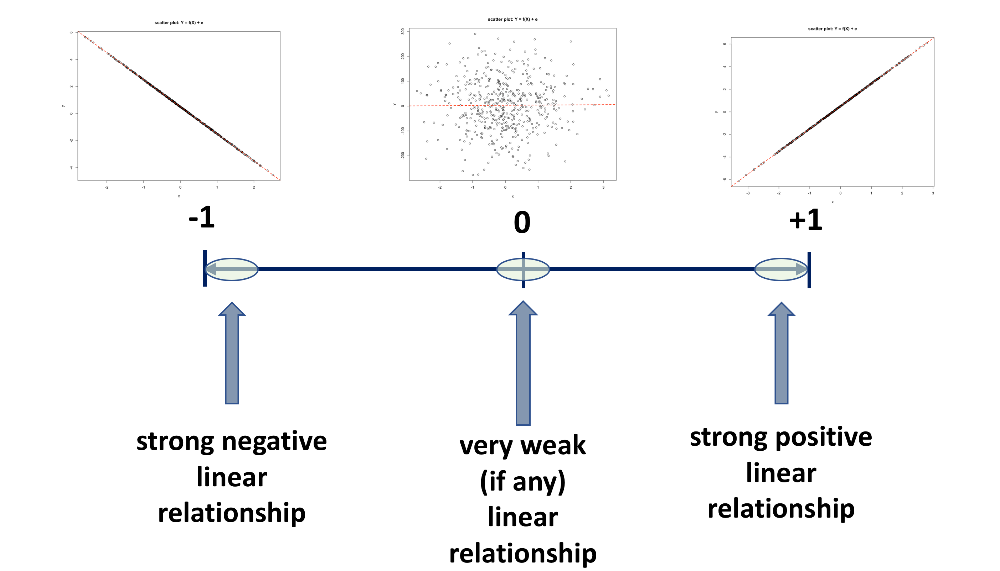
```

In fact, the correlation is a parameter of the bivariate normal distribution, that is **used to describe the association** between two variables, which does not include a cause and effect statement. That is, one variable does not depend on the other, i.e. the variables are not labelled as dependent and independent. Rather, they are considered as two random variables that seem to vary together. Hence, it is important to recognise that *correlation does not imply causation*. In correlation analysis, both $Y$ and $X$ are assumed to be random variables, whilst in linear regression, $Y$ is assumed to be a random variable and $X$ is assumed to be a fixed variable.

The main characteristics of the correlation coefficient $r$ are:

-   there are no units for the correlation coefficient

-   it lies between $-1 \leqslant r \leqslant 1$

    -   when its value is near -1 or +1 it shows a strong linear association
    -   a correlation coefficient of -1 or +1 indicates a perfect linear association
    -   value near 0 suggests no relationship

-   the sign of the correlation coefficient indicates the directions of the association

    -   a positive $r$ is associated with an estimated positive slope
    -   a negative $r$ is associated with an estimated negative slope

**BUT!!!**

-   $r$ is a measure of the strength of a linear association and it should not be used when the relationship is non-linear, therefore $r$ is NOT used to measure the strength of a curved line
-   $r$ is sensitive to outliers
-   $r$ does not make a distinction between the response variable and the explanatory variable. That is, the correlation of $X$ with $Y$ is the same as the correlation of $Y$ with $X$.
-   in simple linear regression, squaring the correlation coefficient, $r^2$, results in the value of the coefficient of determination $R^2$

[The **Spearman rank correlation coefficient** is a corresponding nonparametric equivalent of the Pearson correlation coefficient. This statistic is computed by replacing the data values with their ranks and applying the Pearson correlation formula to the ranks of the data. Tied values are replaced with the average rank of the ties. Just like in the case of the Pearson coefficient, this one is also really a measure of association rather than correlation, since the ranks are unchanged by a monotonic transformation of the original data. For sample sizes greater than 10, the distribution of the Spearman rank correlation coefficient can be approximated by the distribution of the Pearson correlation coefficient. It is also worth knowing that the Spearman rank correlation coefficient uses weights when weights are specified.]{style="color:darkred"}

### The coefficient of determination $R^2$

We realise that when fitting a regression model we are seeking to find out how much variance is explained, or is accounted for, by the explanatory variable $X$ in an outcome variable $Y$.

In the earlier example the following has been calculated:

i.  $\text{The Total Variation in }$$Y = 82.00$
ii. $\text{The Explained Variation in }$$Y = 78.23$
iii. $\text{The Unexplained Variation in }$$Y = 3.77$

Notice the relationship given below, is satisfied

$$\text{The Total Variation in Y = Explained Variation + Unexplained Variation}$$

$$82.00 = 78.23 + 3.77$$ What do these quantities tell us? They are difficult to interpret because they are expressed in the units of the problem.

Consider the following ratio:

${\text{The Explained Variation in Y} \over \text{The Total Variation in Y}} = {78.23 \over 82.00} = 0.954$

This is saying that $0.954$ or $95.4\%$ of the changes in $Y$ are explained by changes in $X$. This is a useful and useable measure of the effectiveness of the match between the actual $Y$ values and the predicted $Y$ values.

Reviewing the five scatter plots (Graphs 1 to 5) it can easily be seen that if the line is a perfect fit to the actual $Y$ values as in *Graphs 1 & 5* then this ratio will have the value $1$ or $100\%$.

If there is no link between $Y$ and $X$ then the *The Explained Variation* is zero hence the ratio will be $0$ or $0\%$. An example of this is shown in *Graph 3*.

The remaining graphs: *Graphs 2 & 4* show a statistical relationship hence this ratio will lie between $0$ & $1$. The closer the ratio is to zero the less strong the link is, whilst the closer the ratio is to $1$ the stronger the connection is between $X$ & $Y$.

**The Ratio:**

$$R^2 = {\text{The Explained Variation in Y} \over \text{The Total Variation in Y}}$$

is called **the Coefficient of Determination**, and usually labelled as $R^2$, and may be defined as **the proportion of the changes in** $Y$ explained by changes in $X$.

This ratio is always on the scale $0$ to $1$, but by convention is usually expressed as a percentage, so is regarded as on the scale $0$ to $100\%$. The interpretation of this ratio is as follows:

```{r R_sq_interp, out.width = "500px",  fig.align = 'center', echo=FALSE}
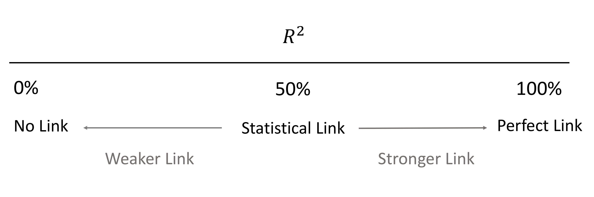
```

The theoretical minimum $R^2$ is $0$. However, since linear regression is based on the best possible fit, $R^2$ will always be greater than zero, even when the predictor and outcome variables bear no relationship to one another. The definition and interpretation of $R^2$ is a very **important tool** in the data analyst's tool kit **for tracking connections between a measured response variable and a measured explanatory**

## A Real Example

So far we have discussed the ideas behind studying relationships between variables in general terms.

To make these ideas more concrete, we will now work with a real dataset taken from a published study. Using real data helps us see how regression modelling is applied in practice.

### The Study Behind the Data

The dataset used in this lecture comes from the following study:

Smith, C. (2025). *The Impact of Homework Deadline Times on College Student Performance and Stress: A Quasi-Experiment in Business Statistics*. Journal of Statistics and Data Science Education, 33(3), 334–343. <https://doi.org/10.1080/26939169.2024.2441692>

The study investigates whether the timing of homework deadlines affects student performance and stress levels.

Researchers collected data from students enrolled in a statistics course and compared outcomes under different homework deadline policies.

::: callout-note
You are not expected to read the full paper for this lecture, but it provides useful context for the dataset we will analyse.
:::

### Why Study Relationships?

Many questions in statistics involve understanding relationships between variables.

For example:

-   does study time affect exam performance?
-   does advertising affect sales?
-   does the timing of homework deadlines affect student outcomes?

Regression analysis helps us quantify these relationships.

In this lecture we will explore these ideas using the homework deadline dataset.

### Loading the Homework Dataset

```{r}
#| label: load_homework_data
#| echo: true
#| message: false
#| warning: false

library(dplyr)
hw <- read.csv("https://raw.githubusercontent.com/TanjaKec/mydata/master/HW_R.csv")

glimpse(hw)
```

The `glimpse()` function provides a quick overview of the structure of the dataset.

Each row represents a single student observation, while each column represents a variable recorded in the study. The output shows the name of each variable, its data type, and a few example values.

Before carrying out any statistical analysis, it is important to understand what the variables represent and how they might be used in a regression model.

## Understanding the Variables

Several variables in this dataset describe characteristics of the students and their study behaviour.

Some of the key variables include:

-   `HW_minutes` – the total number of minutes a student reported spending on homework\
-   `Midnight_deadline` – an indicator for whether the course used a midnight homework deadline\
-   `GPA` – the student's grade point average\
-   `Grade_course` – the student's overall course grade\
-   `Grade_HW` – the student's homework grade

Other variables record demographic characteristics such as gender, academic major, and year in school.

In regression analysis we typically distinguish between two types of variables:

-   a **response variable**, which is the outcome we want to explain
-   an **explanatory variable**, which may help explain variation in the response

## Choosing Variables for Analysis

A natural question in the context of this study is whether the amount of time students spend on homework is related to their homework performance.

To explore this idea we begin with:

-   **Response variable:** `Grade_HW`\
-   **Explanatory variable:** `HW_minutes`

Both variables are measured numerically, which makes them suitable for a **simple linear regression model**. Before fitting a regression model, it is useful to first visualise the relationship between the two variables using a scatterplot.

```{r}
#| label: hw_scatterplot
#| echo: true

plot(Grade_HW ~ HW_minutes,
     data = hw,
     pch = 19,
     col = rgb(70,130,180,120,maxColorValue = 255),  # transparent steelblue
     xlab = "Homework time (minutes)",
     ylab = "Homework grade",
     main = "Homework Grade vs Homework Time")

abline(lm(Grade_HW ~ HW_minutes, data = hw),
       col = "red",
       lwd = 2)
```

Each point on the graph represents a single student. The horizontal axis shows the amount of time spent on homework, while the vertical axis shows the student's homework grade.

The red line represents the **line of best fit**, which summarises the overall relationship between homework time and homework performance. In the next section we will see how this line is estimated using regression modelling.

::: callout-important
## Your Turn 👉 Stop and Think 🤔

Based on the scatterplot, consider the following:

-   Does the relationship appear **positive**, **negative**, or **unclear**?
-   Do students who spend **more time on homework** tend to achieve **higher grades**?

Take a moment to think about this before continuing.
:::

Visual inspection of the scatterplot gives us an initial idea of whether a relationship may exist between the two variables.

However, visual inspection alone is not sufficient. To analyse the relationship more formally, we now fit a **simple linear regression model**.

## From Scatterplot to Regression

A scatterplot allows us to visually inspect whether a relationship may exist between two variables. However, visual inspection alone is not sufficient. We often want a **mathematical description** of the relationship.

Regression analysis provides a way to summarise the relationship between two variables using a straight line that best represents the overall pattern in the data.

This line is called the **regression line** or the **line of best fit**.

In simple linear regression, the relationship between the variables is written as

$$
Y = \beta_0 + \beta_1 X + e
$$

where

**- \\(Y\\)** is the **response variable**

**- \\(X\\)** is the **explanatory variable**

**- \\(\\beta_0\\)** is the **intercept**

**- \\(\\beta_1\\)** is the **slope**

**- \\(e\\)** represents the **influence of other factors not included in the model**

The slope tells us how much the response variable changes when the explanatory variable increases by one unit.

```{r}
#| label: hw_regression_model
#| echo: true

model_hw <- lm(Grade_HW ~ HW_minutes, data = hw)

model_hw
```

The `lm()` function in R fits a **linear model**.

In this case, we are estimating the relationship between:

-   `Grade_HW` (homework grade)
-   `HW_minutes` (time spent on homework)

The output provides estimates of the intercept and the slope of the regression line.

```{r}
#| label: hw_regression_line
#| echo: true

plot(Grade_HW ~ HW_minutes,
     data = hw,
     pch = 19,
     col = rgb(70,130,180,120,maxColorValue = 255),
     xlab = "Homework time (minutes)",
     ylab = "Homework grade",
     main = "Homework Grade vs Homework Time")

abline(model_hw, col = "red", lwd = 2)
```

The red line is the **estimated regression line**.

It summarises the overall relationship between homework time and homework performance.\
Points above the line represent students who performed **better than predicted**, while points below the line represent students who performed **worse than predicted**.

::: callout-tip
## Think about it

Does the regression line suggest that spending more time on homework is associated with **higher grades**, **lower grades**, or **no clear relationship**?
:::

## Residuals

When we fit a regression line to the data, not all points lie exactly on the line.

For each observation, the regression model produces a **predicted value** of the response variable. This predicted value is usually written as:

$$
\hat{Y}
$$

The difference between the observed value and the predicted value is called the **residual**.

$$
\text{Residual} = Y - \hat{Y}
$$

Residuals measure the vertical distance between each observed data point and the regression line.

```{r}
#| label: hw_residuals
#| echo: true

hw$fitted <- fitted(model_hw)
hw$residuals <- resid(model_hw)

head(hw[, c("Grade_HW","HW_minutes","fitted","residuals")])
```

The fitted values (`fitted`) represent the predicted homework grade produced by the regression model.

The residuals measure the difference between the actual grade and the predicted grade.

-   A **positive residual** means the student performed **better than predicted**.
-   A **negative residual** means the student performed **worse than predicted**.

```{r}
#| label: hw_residual_plot
#| echo: true

plot(Grade_HW ~ HW_minutes,
     data = hw,
     pch = 19,
     col = rgb(70,130,180,120,maxColorValue = 255),
     xlab = "Homework time (minutes)",
     ylab = "Homework grade",
     main = "Residuals and the Regression Line")

abline(model_hw, col = "red", lwd = 2)

segments(hw$HW_minutes,
         hw$fitted,
         hw$HW_minutes,
         hw$Grade_HW,
         col = "darkgrey")
```

The vertical grey lines show the **residuals**.

Each line represents the difference between the actual value and the value predicted by the regression model.

Shorter residuals indicate that the regression line fits the data more closely.

::: callout-tip
## Think about it

Do most points lie close to the regression line, or are they widely scattered?

What does this suggest about how well homework time explains variation in homework grades?
:::

The residuals represent the portion of the variation in the response variable that is **not explained** by the regression model.

This leads to an important idea in regression analysis: the total variation in the response variable can be divided into two components:

-   **explained variation** - captured by the regression model
-   **unexplained variation** - captured by the residuals

Mathematically, this decomposition can be written as

$$
\sum (Y - \bar{Y})^2 =
\sum (\hat{Y} - \bar{Y})^2 +
\sum (Y - \hat{Y})^2
$$

where

$Y$ is the observed value

$\hat{Y}$ is the predicted value from the regression model

$\bar{Y}$ is the mean of the response variable

### Explained and Unexplained Variation

The total variation in the response variable can be decomposed into two parts:

-   **explained variation**, captured by the regression model

-   **unexplained variation**, captured by the residuals

This decomposition forms the basis for several important quantities in regression analysis, including the coefficient of determination $R^2$ and the F-test.

Mathematically, this decomposition can be written as

$$
\text{Total Variation}
=
\text{Explained Variation}
+
\text{Unexplained Variation}
$$

or more specifically

$$
\sum (Y - \bar{Y})^2 =
\sum (\hat{Y} - \bar{Y})^2 +
\sum (Y - \hat{Y})^2
$$

where

-   $Y$ is the observed value\
-   $\hat{Y}$ is the predicted value from the regression model\
-   $\bar{Y}$ is the mean of the response variable

In this decomposition:

-   $Y - \bar{Y}$ measures how far each observation is from the overall average\
-   $\hat{Y} - \bar{Y}$ measures the variation explained by the regression model\
-   $Y - \hat{Y}$ measures the unexplained variation (the residual)

::: callout-tip
## Key idea

A **good regression model** explains a large portion of the total variation in the response variable.

This means that the residuals will tend to be **small**, because the model closely matches the observed data.
:::

To summarise how much of the total variation is explained by the model, we use the **coefficient of determination**, denoted by $R^2$.

$$
\text{Scatterplot} \;\rightarrow\; 
\text{Regression Line} \;\rightarrow\; 
\text{Residuals} \;\rightarrow\; 
\text{Variation} \;\rightarrow\; 
R^2
$$

We will examine this quantity next.

## The Coefficient of Determination $R^2$

The decomposition of variation leads to an important summary measure in regression analysis: the **coefficient of determination**, denoted by $R^2$.

The coefficient of determination measures the **proportion of the total variation in the response variable that is explained by the regression model**.

It is defined as

$$
R^2 =
\frac{\text{Explained Variation}}{\text{Total Variation}}
$$

The value of $R^2$ always lies between 0 and 1.

-   $R^2 = 0$ indicates that the model explains none of the variation in the response variable.
-   $R^2 = 1$ indicates that the model perfectly explains the variation.

In practice, most regression models lie somewhere between these two extremes.

### Obtaining $R^2$ in R

To obtain detailed information about the fitted regression model we use the `summary()` function.

```{r}
#| label: hw_model_summary 
#| echo: true

summary(model_hw)
```

The summary() function provides a detailed statistical summary of the regression model, including:

-   the estimated regression coefficients

-   the variability of the residuals

-   measures of how well the model fits the data

-   statistical tests used to evaluate the relationship between the variables

One of the key quantities reported in this output is the coefficient of determination $R^2$.

### Interpreting the $R^2$ value

For our regression model the coefficient of determination is

$$
R^2 = 0.065
$$

This means that approximately 6.5% of the variation in homework grades is explained by the amount of time students spend on homework.

The remaining 93.5% of the variation must be due to other factors that are not included in the model.

::: callout-tip
## Pause and think

Do you think this is a **good model or a poor model**?

Why?

Consider the following:

-   the slope coefficient is statistically significant
-   the value of $R^2$ is relatively small
-   the scatterplot shows substantial variability in grades

What does this suggest about the ability of homework time to explain differences in homework performance?
:::

Although the value of $R^2$ is relatively small, this does **not necessarily mean that the model is useless**.

In studies involving human behaviour and performance, it is common for many different factors to influence the outcome. As a result, simple regression models that include only one explanatory variable often explain only a modest proportion of the overall variation.

In our case, homework time appears to have a measurable relationship with homework grades, but it clearly does **not capture all of the factors that influence student performance**.

The regression model therefore suggests that **time spent on homework is one factor influencing homework grades, but many other factors must also play an important role**.

The value of $R^2$ tells us how much of the variation in homework grades is explained by homework time.

However, to fully understand the connection between the variables we must also describe the **nature of the relationship** itself, i.e. we still need to answer an important question:

**What does the relationship between homework time and homework grades actually look like?**

### Further Data Analysis (FDA)

So far we have examined the regression model and the value of $R^2$.

However, before using the model for interpretation or prediction, we must determine whether the relationship observed in the sample data is statistically meaningful.

This question can be answered using a hypothesis test based on the **F-statistic**, which evaluates whether the regression model explains a statistically significant portion of the variation in the response variable.

Like all hypothesis tests, this procedure is carried out in four stages:

1.  Specify the hypotheses

2.  Define the test parameters and decision rule

3.  Examine the sample evidence

4.  State the conclusion

### Stage 1: Specify the Hypotheses

The hypotheses test whether the explanatory variable helps explain variation in the response variable.

$$
H_0 : \beta_1 = 0
$$

There is **no relationship** between homework time and homework grades.

$$
H_1 : \beta_1 \neq 0
$$

There **is a relationship** between homework time and homework grades.

### Stage 2: Decision Rule

The hypothesis test is based on the **F-statistic**, which follows an F distribution.

The decision rule compares the calculated value of the statistic, denoted ($F_{calc}$), with a critical value ($F_{crit}$).

If the test statistic lies in the rejection region, we reject the null hypothesis and conclude that there is evidence of a relationship between the variables.

The F-test compares the variation explained by the regression model with the variation that remains unexplained.

If the explained variation is sufficiently larger than the unexplained variation, the model is considered statistically significant.

```{r}
#| label: f_test_decision_rule
#| echo: false
#| fig-align: center
#| out-width: "500px"

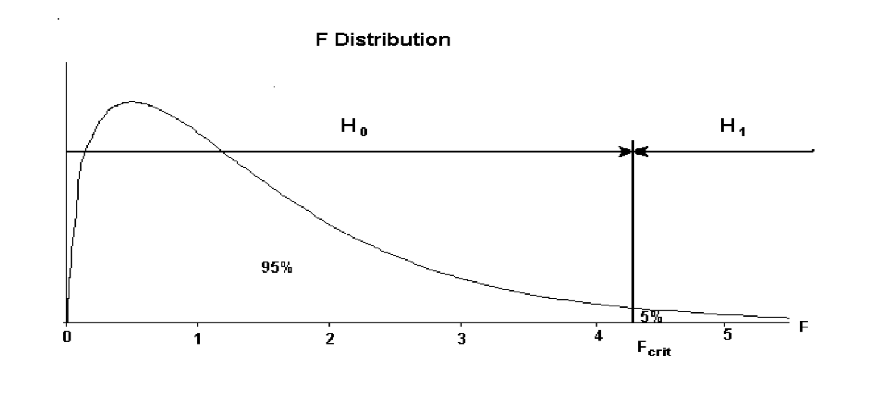
```

The decision rule can therefore be summarised as:

-   If ($F_{calc}$ \< $F_{crit}$) $→$ do **not reject** ($H_0$)
-   If ($F_{calc}$ \> $F_{crit}$) $→$ **reject** ($H_0$)

### Stage 3: Sample evidence (use your model)

We now examine the sample evidence obtained from the fitted regression model.

```{r}
summary(model_hw)
```

From the regression output we obtain the value of the F-statistic, which measures the relative size of the explained variation compared with the unexplained variation.

For this model the calculated statistic is:

-   $F = 5.748$

To apply the decision rule we also need the degrees of freedom of the test:

-   $df_1 = 1$ (regression degrees of freedom)

-   $df_2 = 83$ (residual degrees of freedom)

Using these degrees of freedom, the critical value of the F distribution at the $5%$ significance level is:

```{r}
#| echo: true
# The critical value corresponds to the 95th percentile of the F distribution with df_1 = 1 and df_2 = 83.
F_crit <- qf(0.95, 1, 83) # the 95th percentile (critical value) of the F distribution
F_crit
```

$F_{crit} \approx 3.96$

We now compare the calculated value with the critical value:

$F_{calc} = 5.748 \quad > \quad F_{crit} = 3.96$

Therefore, according to the decision rule, we reject the null hypothesis $H_0$.

The calculated F-statistic is larger than the critical value, which means that the variation explained by the regression model is sufficiently large relative to the unexplained variation.

### Stage 4: Conclusion

Since

$F_{calc} > F_{crit}$

we reject the null hypothesis $H_0$.

This provides statistical evidence that there is a relationship between homework time and homework grades.

Since the regression model appears to describe a statistically significant relationship, we can now describe the nature of that relationship using the estimated regression equation.

$\hat{Y} = 23.10 + 0.021 HW_{minutes}$

## Describing the Nature of the Relationship

Earlier we asked whether there is evidence of a relationship between homework time and homework grades.

The regression model suggests that such a relationship exists, but it is relatively weak.

The estimated regression equation is

$$
\widehat{\text{Grade\_HW}} = 23.10 + 0.021 \times \text{HW\_minutes}
$$

The positive slope of the regression line indicates that **as the amount of time spent on homework increases, the predicted homework grade tends to increase**.

However, the value of $R^2 = 0.065$ indicates that this relationship explains only a small proportion of the variation in homework grades.

This suggests that although homework time may influence performance, **many other factors also affect student outcomes**.

::: callout-tip
## Think about it

What other factors might influence homework grades besides the amount of time spent on homework?

For example, consider:

-   prior knowledge of the material
-   study strategies
-   motivation
-   stress levels
-   outside commitments
:::

## Using the Model to Make Predictions

One of the main purposes of regression models is to make predictions about the response variable for given values of the explanatory variable.

Using the estimated regression equation

$$
\widehat{\text{Grade\_HW}} = 23.10 + 0.021 \times \text{HW\_minutes}
$$

we can predict the homework grade for a student who spends a specific amount of time on homework.

Suppose a student spends **120 minutes** on homework.

Substituting this value into the regression equation gives

$$
\widehat{\text{Grade\_HW}}
=
23.10 + 0.021 \times 120
$$

$$
\widehat{\text{Grade\_HW}} \approx 25.6
$$

The model therefore predicts that a student who spends **120 minutes on homework** would obtain a homework grade of approximately **25.6**.

```{r}
#| label: hw_prediction_example
#| echo: true

23.10 + 0.021 * 120
```

or we can use `predict()` function

```{r}
#| label: hw_prediction_predict
#| echo: true

predict(model_hw,
        newdata = data.frame(HW_minutes = 120))
```

### A Note on Prediction

Regression models are most reliable when used to make predictions **within the range of the observed data**.

If we attempt to make predictions for values of the explanatory variable far outside the range observed in the dataset, the predictions may be unreliable. This situation is known as **extrapolation**.

It is therefore important to examine the range of the explanatory variable before using the regression model for prediction.

```{r}
#| label: hw_range
#| echo: true

summary(hw$HW_minutes)
```

## The ANOVA Table

The F-test used above is closely related to the analysis of variance (ANOVA) framework.

We can obtain the ANOVA table in R using:

```{r}
#| label: hw_anova
#| echo: true

anova(model_hw)
```

The ANOVA table provides another way of presenting the same information about the regression model by explicitly separating the variation in the response variable into:

-   variation explained by the regression model
-   variation left unexplained (the residual variation)

The F-statistic compares these two quantities.

If the explained variation is large relative to the unexplained variation, the regression model is considered statistically significant.

This is exactly the same decomposition introduced earlier:

$$
\text{Total Variation}
=
\text{Explained Variation}
+
\text{Unexplained Variation}
$$

The F-statistic in the ANOVA table compares the amount of variation explained by the model with the amount left unexplained.

If the explained variation is large relative to the unexplained variation, the F-statistic will be large and the model will be statistically significant.

For our model, the ANOVA table confirms the earlier conclusion from the regression summary: there is statistical evidence of a relationship between homework time and homework grades, although the relationship is relatively weak.

## Conclusion

In this lecture we introduced the core ideas behind regression.

We saw that:

-   a **scatterplot** provides an important first view of the relationship between two measured variables
-   a **regression line** summarises the overall pattern in the data
-   **residuals** measure the difference between observed values and predicted values
-   the variation in the response can be divided into **explained** and **unexplained** components
-   the coefficient of determination, $R^2$, measures the proportion of variation explained by the model

Together, these ideas provide the foundation for regression modelling.

In the next notebook, we will apply these concepts to a real dataset and see how regression is used in practice.

---

## Your Turn 👉

Before moving on, think about the following questions:

1.  What does the slope of a regression line represent?

2.  What does a residual measure?

3.  If a regression model has a very small value of $R^2$, what does this tell us about the relationship between the variables?

4.  Can a relationship be statistically significant even if $R^2$ is small? Why?

Discuss your answers with a partner or write a short explanation in your notes.
